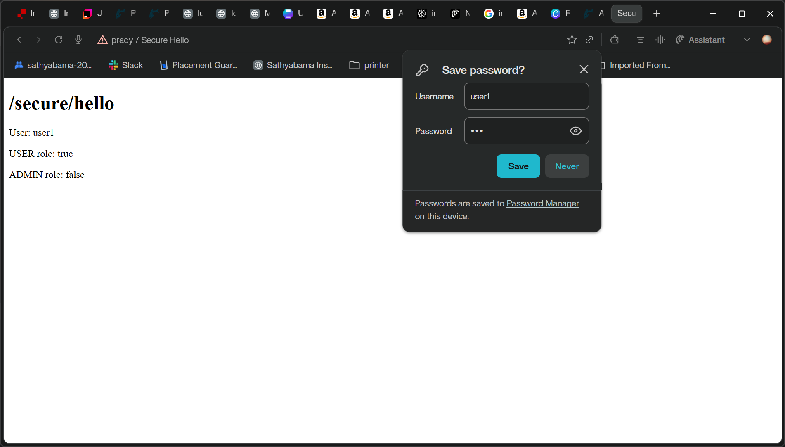
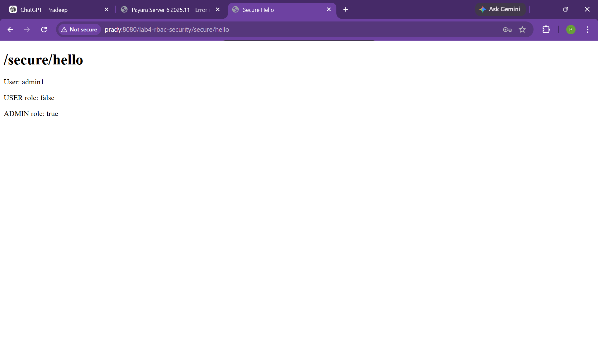
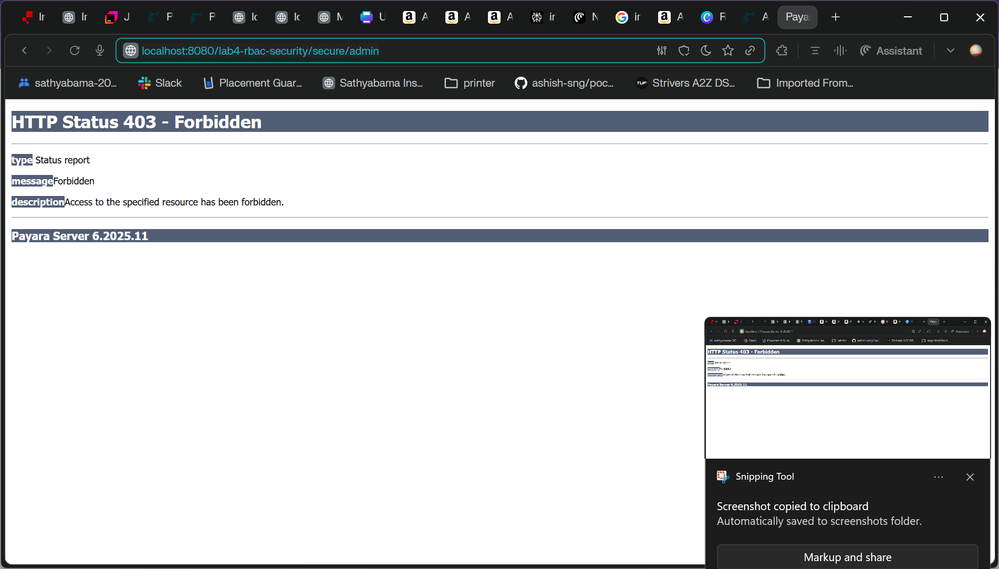
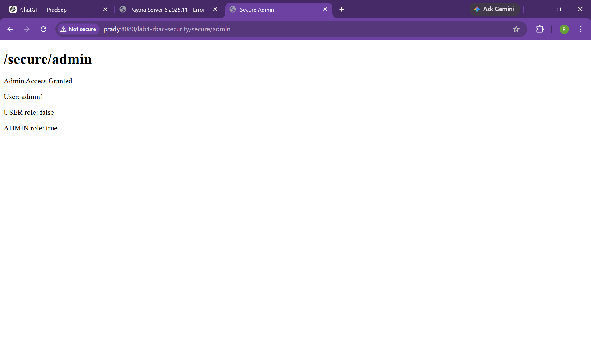

# Lab 4: RBAC Security (Jakarta EE)

This project demonstrates role-based access control using container-managed security (`BASIC` auth) for two secured endpoints:

- `/secure/hello` -> accessible to `USER` and `ADMIN`
- `/secure/admin` -> accessible to `ADMIN` only

## Tech Stack

- Jakarta EE 10 (WAR packaging)
- Servlet API
- GlassFish/Payara-compatible `web.xml` and `glassfish-web.xml`
- Java 21
- Maven Wrapper

## Run

1. Build WAR:
   ```powershell
   .\mvnw.cmd clean package
   ```
2. Deploy `target/lab4-rbac-security-1.0-SNAPSHOT.war` to your server.
3. Open:
   - `http://<host>:<port>/lab4-rbac-security/secure/hello`
   - `http://<host>:<port>/lab4-rbac-security/secure/admin`

## Security Config

- Roles declared: `USER`, `ADMIN`
- Auth method: `BASIC`
- Realm: `file`
- Role mapping is configured in `src/main/webapp/WEB-INF/glassfish-web.xml`

## Sample Output Screenshot

Authenticated `USER` access to `/secure/hello`:



Authenticated `ADMIN` access to `/secure/hello`:



Authenticated `USER` access to `/secure/admin` is denied (`HTTP 403 Forbidden`):



Authenticated `ADMIN` access to `/secure/admin` is allowed:


